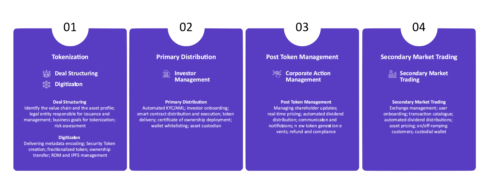

# Step-by-Step

Tokenization transforms traditional assets into digital tokens on a blockchain, providing enhanced accessibility, liquidity, and flexibility. Below are the essential steps in the tokenization process to bring an asset on-chain:

1. **Asset Identification**
    
    Begin by identifying the asset to be tokenized. Assets can vary widely, from tangible assets like real estate or commodities to intangible assets like equity shares in a company. The type of asset determines the regulatory approach and structure required for tokenization.
    
2. **Legal Structuring**
    
    Legal structuring is critical in the tokenization process. This involves setting up the necessary legal framework to ensure the asset’s tokenization complies with regulations. Special Purpose Vehicles (SPVs) or segregated accounts may be created to hold the asset and manage its ownership. This structure ensures legal clarity and separates the tokenized asset from other assets, reducing risks for investors.
    
3. **Token Creation**
    
    The digital token creation process takes place on a blockchain. Each token represents a share of ownership or stake in the underlying asset. Depending on the asset's structure and intended use, tokens can represent fractional or full ownership. Valuit uses blockchain standards, like ERC-3643 for security tokens, to ensure regulatory compliance and transparency.
    
4. **Compliance and Registration**
    
    Compliance is a fundamental aspect of tokenization. Regulatory checks such as KYC (Know Your Customer) and AML (Anti-Money Laundering) are performed to verify investor identities and prevent illicit activities. The asset may also need to be registered with regulatory bodies, depending on jurisdiction, to meet local laws and regulations. This step ensures the tokenized asset can be legally issued and traded.
    
5. **Ownership Transfer**
    
    Once the tokens are created and compliance verified, ownership of the asset is legally transferred to the tokens. Token holders have ownership rights or claims to the asset based on the number of tokens they possess. These tokens can then be transferred or traded, with ownership tracked transparently and immutably on the blockchain.
    
6. **Trading and Management**
    
    After tokenization, tokens can be actively traded on secondary markets, providing liquidity and flexibility that traditional asset ownership may not offer. Token holders can buy, sell, or hold these tokens across decentralized platforms or exchanges. With Valuit’s integrated digital wallet options, investors can seamlessly manage their tokenized assets, monitor performance, and make informed decisions about their investments.