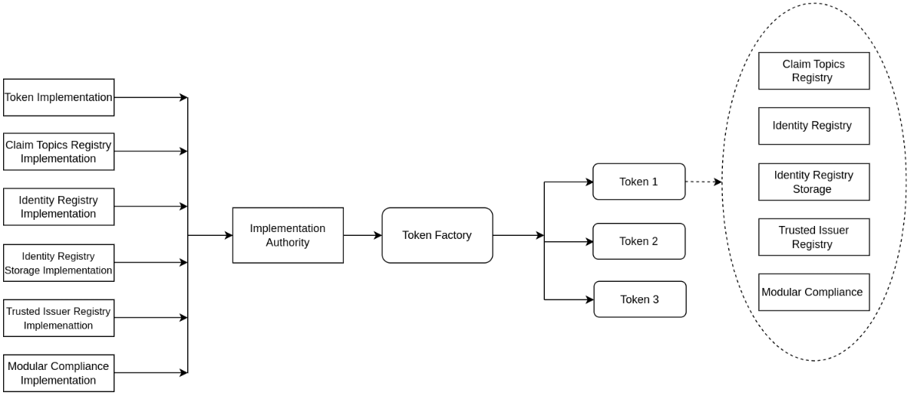
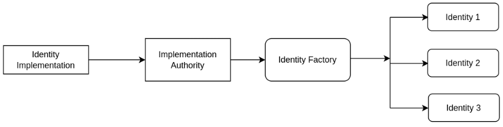
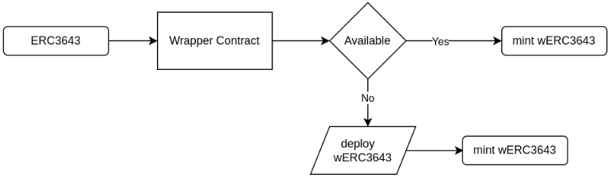

# Overview
## Smart Contracts

Smart Contracts enable secure, compliant digital securities, integrating regulatory standards directly into the token’s architecture. They ensure transactions adhere to legal requirements, enhancing trust and transparency in tokenized assets.

## Smart Contract Architecture

### Token Factory Architecture

### Identity Factory Architecture

### ERC-20 Wrapped Token Contract Architecture

