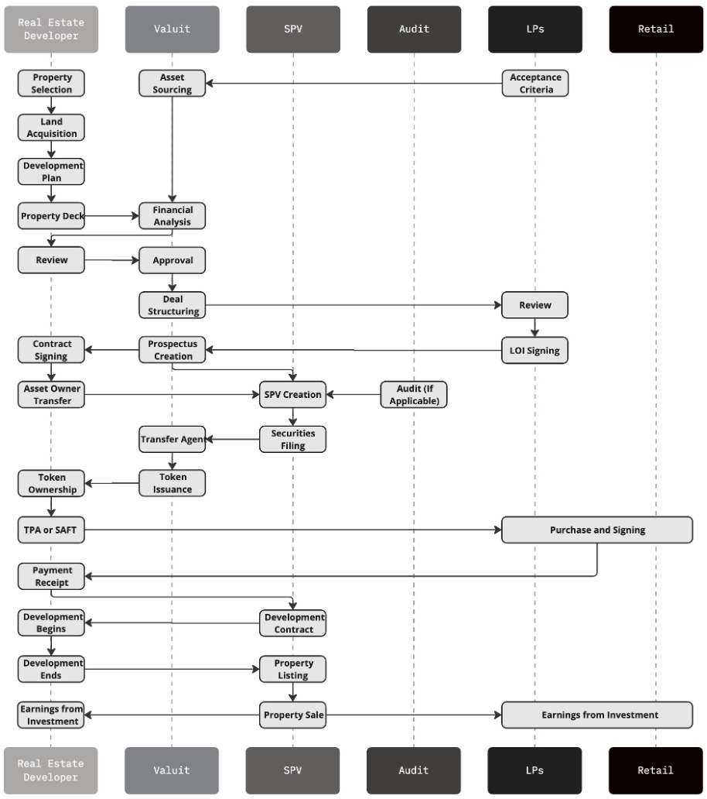
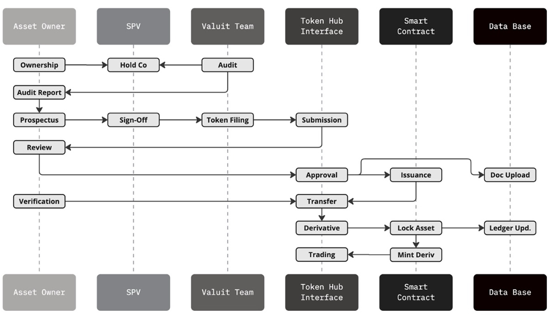

# Asset Onboarding

## Auditing and Deal Structuring:

1. A Special Purpose Vehicle (SPV) is registered in an EU country to facilitate tokenization.
    - SPV ownership created under the current asset owner providing Power of Attorney to BlockRidge for Share Capital Management and transfer agent services.
2. The ownership of the asset is transferred to the SPV and officially filed with the local government to establish clear ownership records.
    - Ownership transfer shall be filed with the local land registry, title office, etc.
3. BlockRidge performs a comprehensive audit on the SPV, asset ownership details, financial records, and title deed to verify legitimacy and compliance with all regulatory requirements.
    - Audit is conducted via a third-party consulting firm agreed upon by both the asset owner and BlockRidge.
4. An operating agreement is provided by BlockRidge, outlining the terms and conditions for the tokenization of the SPV, including governance, operational procedures, share transfer, and shareholder registry information.

## Tokenization and Primary Issuance:

1. A prospectus is filed for the issuance of shares and the minting of asset tokens, ensuring transparency and compliance with regulatory requirements.
2. Utilize BlockRidge’s no-code solution to deploy ERC-3643 smart contracts, simplifying the tokenization process and ensuring security and compliance.
3. Transfer the ownership of the tokenized assets back to the original asset holders through BlockRidge’s Token Hub, ensuring a seamless and compliant transfer.

## Trading and Liquidity:

1. The asset owner transfers the asset tokens to a derivative issuance contract, preparing the tokens for liquidity and trading.
2. Derivative tokens are sent to an external exchange or DeFi platform where they can be liquidated and sold, providing liquidity and enabling the sale of the underlying asset.

## Sample Customer Flow

## General Flow

