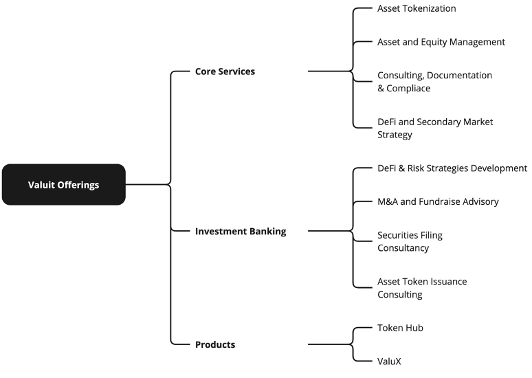

# Services
### Overview

BlockRidge is dedicated to offering a wide range of services that address the needs of asset owners by leveraging the latest advancements in blockchain technology.

### Service Diagram

## Tokenization of Assets

| **Key Benefits** | **Description** |
| --- | --- |
| **Enhanced Liquidity** | Digital tokens can be traded more easily than traditional assets, providing liquidity to markets that were previously illiquid. |
| **Fractional Ownership** | Investors can purchase portions of high-value assets, making it easier for a wider audience to invest. |
| **Alternative Financing** | Blockchain enables alternative financing and leveraging models through decentralized lending and liquidity protocols. |

## Asset and Equity Management

| **Key Benefits** | **Description** |
| --- | --- |
| **Operational Efficiency** | Automation reduces the need for intermediaries, cutting costs and speeding up processes. |
| **Real-Time Information** | Shareholders can instantly access up-to-date information about their investments and company performance. |
| **Improved Governance** | Digital shares facilitate streamlined voting and decision-making processes, enhancing corporate governance. |

## Financial Instruments and Investments

| **Feature** | **Description** |
| --- | --- |
| **User-Friendly Interface** | Our platform is designed to be intuitive and accessible, providing a seamless user experience for all types of investors. |
| **Advanced Security Protocols** | We use cutting-edge security measures, including encryption and multi-signature wallets, to protect investments and personal information. |
| **Seamless Integration** | BlockRidge's solutions integrate effortlessly with existing financial systems, ensuring a smooth transition and enhanced operational efficiency. |