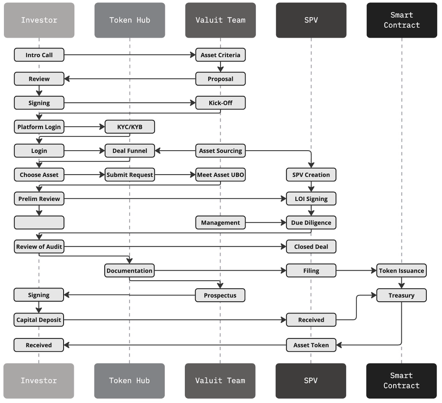

# Investor Onboarding
Valuit's onboarding process is designed to ensure a smooth and efficient integration of liquidity providers onto our platform. We take a comprehensive approach, covering all necessary steps to prepare our partners for successful participation in our ecosystem.

## Onboarding Simplified

Valuit uses an automated onboarding structure for Investors to ensure compliance and efficiency throughout the investment process. In the case of more traditional firms, Valuit offers manual KYC (Know Your Customer) and KYB (Know Your Business) approvals with our compliance team. All information shared during the onboarding process adheres with GDPR regulations to ensure data security and protection.

## Onboarding Process Diagram

## Detailed Onboarding Process

### Initial Consultation and Assessment

1. **Introduction Meeting**
    - Conduct an introductory meeting to understand the potential liquidity provider's needs, goals, and expectations.
    - Provide an overview of Valuit's services and platform functionalities.
2. **Needs Assessment**
    - Perform a detailed assessment of the liquidity provider's investment portfolio, strategies, and requirements.
    - Identify suitable services and solutions offered by Valuit that align with the provider's objectives.
3. **Customized Proposal**
    - Develop a tailored proposal outlining the services, solutions, and onboarding process specific to the liquidity provider.
    - Present the proposal for review and feedback, ensuring all aspects meet the provider's expectations.

### KYC and KYB Procedures

1. **Identity Verification**
    - Conduct thorough Know Your Customer (KYC) and Know Your Business (KYB) procedures to verify the identity and legitimacy of the liquidity provider.
    - Collect and review required documentation, including identification, proof of address, and business registration documents.
2. **Background Checks**
    - Perform comprehensive background checks to ensure compliance with regulatory requirements and to mitigate any potential risks.
    - Verify the liquidity provider's financial standing, reputation, and previous investment activities.
3. **Compliance Review**
    - Ensure that all collected information complies with local and international regulatory standards.
    - Address any compliance issues or discrepancies before proceeding with the onboarding process.

### Account Setup and Platform Access

1. **Platform Access**
    - Provide the liquidity provider with access to the Valuit platform, including secure login credentials and user accounts.
    - Ensure the provider is familiar with the platform's interface, functionalities, and features.
2. **Deal Flow Access**
    - Grant access to the deal flow section of the platform, where the liquidity provider can view and evaluate potential investment opportunities.
    - Provide tools and resources to facilitate due diligence and investment decision-making.
3. **Training and Support**
    - Offer comprehensive training sessions to educate the liquidity provider on how to use the platform effectively.
    - Provide ongoing technical support to address any issues or questions that may arise during the integration process.